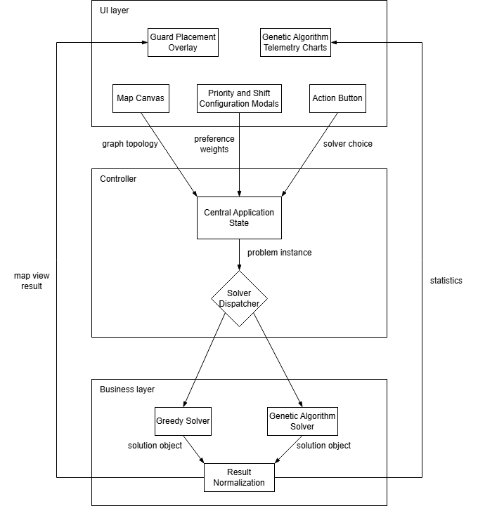

# Museum Guard Solver

Welcome! This web app helps you figure out the best way to place guards in a museum so that every room is watched, using as few guards as possible. On the UI, each room is shown as a square node, and each door is shown as an edge (a line) connecting two rooms. You can draw your own museum layout, connect rooms with doors, and see the results instantly.

## Try It Out

Check out the live app here: https://museum-guard-solver.vercel.app/

## What does this app do?

Imagine you have a museum with lots of rooms and doors. You want to make sure every room is covered by at least one guard, but you also want to use as few guards as you can. This app helps you find the smartest way to do that.

You can:
- Design your own museum map
- Set priorities for different rooms
- See guard placements right on the map

## Application Architecture

## Why two algorithms?

We included both a Greedy algorithm and a Genetic algorithm because they each have their own strengths:

### Greedy Algorithm

This method quickly picks the door that covers the most uncovered rooms, and repeats until all rooms are covered. It's very fast and always gives you the same answer. It's great for big museums or when you just want a quick solution. The answer is usually pretty good, but not always the absolute best.

**Use Greedy when:**
- You want results right away
- Your museum has lots of rooms
- You just need a solid, quick plan

### Genetic Algorithm

This method tries lots of different combinations and "evolves" better solutions over time, kind of like natural selection. It takes longer to run, but it can find better answers, especially for tricky layouts. The results might be a little different each time you run it.

**Use Genetic when:**
- You want the best possible solution
- You want to configure room priorities
- Your layout is complicated and you want to see if you can do better than Greedy
- You want to compare different possible solutions

## Features

- Draw and edit your own museum layout
- Instantly see where guards should go
- Set different priorities for rooms
- Manage different shifts and coverage needs
- Compare results from both algorithms
- Watch the Genetic algorithm improve solutions over time

Built with Next.js, TypeScript, and Vitest.
